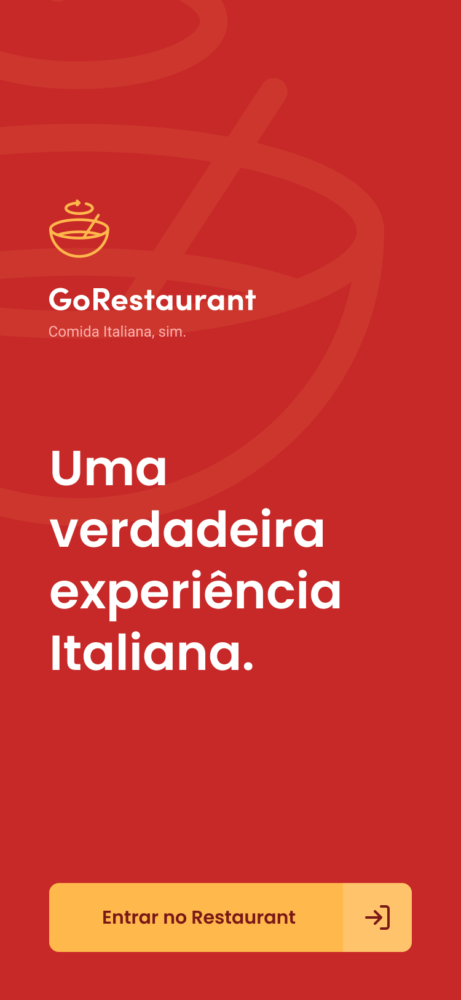
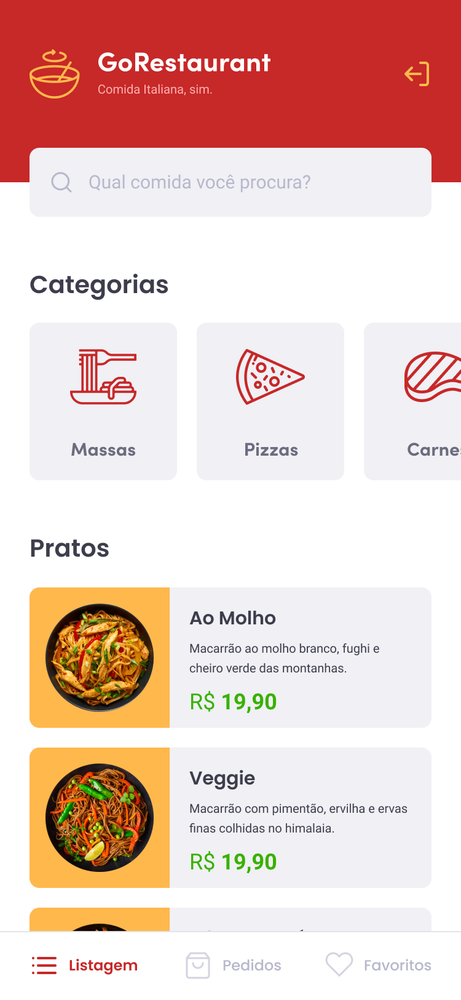

# Nivel 5 desafio 11 GoRestaurant Mobile

Nesse desafio, você irá desenvolver mais uma aplicação, a GoRestaurant, só que dessa vez a versão mobile para o cliente. Agora você irá praticar o que você aprendeu até agora no React Native junto com TypeScript, para criar um pequeno app para pedidos de comida.

Essa será uma aplicação que irá se conectar a uma Fake API, e exibir e filtrar os pratos de comida da API e permitir a criação de novos pedidos.

link do desafio: https://github.com/rocketseat-education/bootcamp-gostack-desafios/tree/master/desafio-react-native-delivery

Para executar apalicação, digite os seguintes comandos:

Para servidor server.json:

```js
  yarn json-server server.json -p 3333
```

Para aplicação mobile:

```js
  yarn && yarn android && yarn start
```
<p>Imagens da aplicação</p>
<p float="left">


</p>
